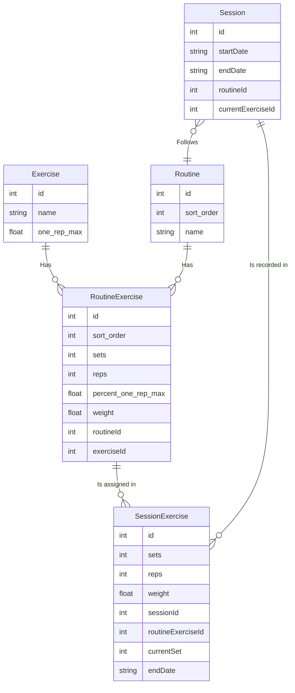

```mermaid
erDiagram
    Exercise ||--o{ RoutineExercise : "Has"
    Routine ||--o{ RoutineExercise : "Has"
    RoutineExercise ||--o{ SessionExercise : "Is assigned in"
    Session ||--o{ SessionExercise : "Is recorded in"
    Session }o--|| Routine : "Follows"

    Exercise {
        int id
        string name
        float one_rep_max
    }

    Routine {
        int id
        int sort_order
        string name
    }

    RoutineExercise {
        int id
        int sort_order
        int sets
        int reps
        float percent_one_rep_max
        float weight
        int routineId
        int exerciseId
    }

    Session {
        int id
        string startDate
        string endDate
        int routineId
        int currentExerciseId
    }

    SessionExercise {
        int id
        int sets
        int reps
        float weight
        int sessionId
        int routineExerciseId
        int currentSet
        string endDate
    }

```
