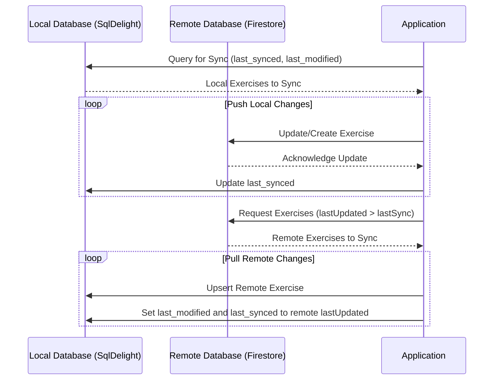
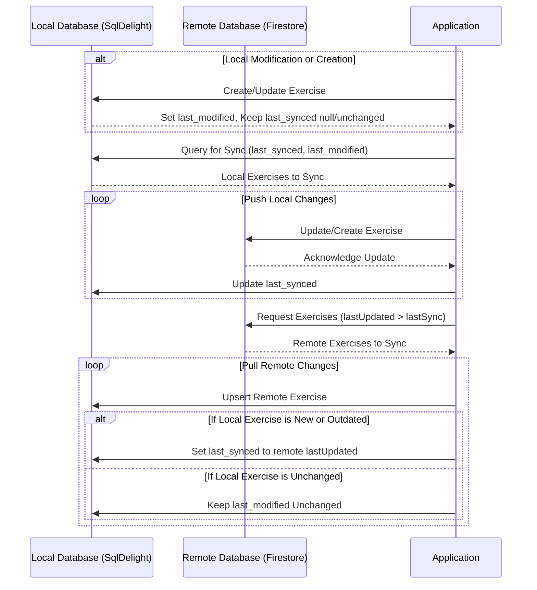

---

# Syncing Strategy for Lift

## Overview
This document outlines the syncing strategy implemented in Lift. The app synchronizes data between a local database managed by SqlDelight and a remote database hosted on Firestore.

## Sync Logic

### Local Database (SqlDelight)
- **Entities**: Exercise
- **Properties**:
    - `last_modified`: Timestamp updated whenever a local change is made.
    - `last_synced`: Timestamp updated after successful sync with the remote database.

### Remote Database (Firestore)
- **Entities**: Exercise
- **Properties**:
    - `lastUpdated`: Server-managed timestamp (`@ServerTimestamp`) updated on creation or modification.

### Sync Process
The sync process consists of two main operations: pulling data from remote to local and pushing data from local to remote.

#### Pulling Data (Remote to Local)
1. Fetch all remote exercises where `lastUpdated` > local `lastSync`.
2. Upsert fetched exercises into the local database:
    - If local exercise does not exist.
    - If local `last_modified` < remote `lastUpdated`.
3. Set both last_synced and last_modified to remote lastUpdated timestamp for each upserted exercise.

#### Pushing Data (Local to Remote)
1. Select local exercises where `last_synced` is null or `last_modified` > `last_synced`.
2. Push selected exercises to the remote database and update `last_synced`.

## Conflict Resolution
In case of concurrent updates, remote changes are prioritized. This needs to be handled carefully to avoid overwriting unsynced local changes.

## Sequence Diagram

