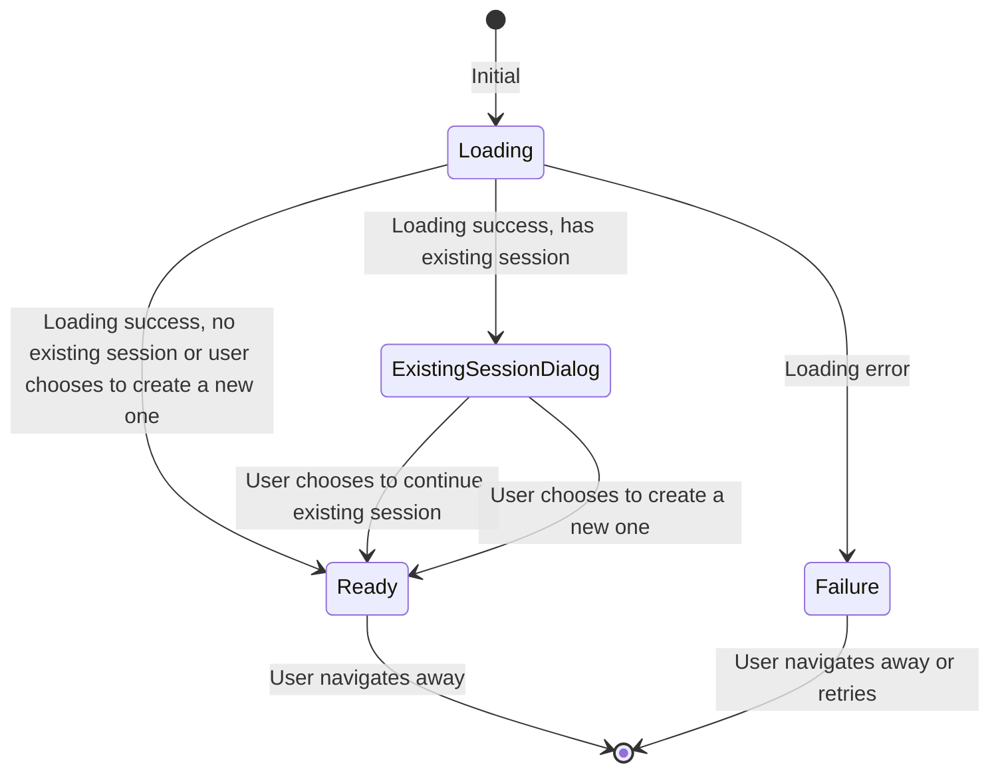

```mermaid

stateDiagram-v2
    [*] --> Loading: Initial
    Loading --> ExistingSessionDialog: Loading success, has existing session
    Loading --> Ready: Loading success, no existing session or user chooses to create a new one
    Loading --> Failure: Loading error
    ExistingSessionDialog --> Ready: User chooses to continue existing session
    ExistingSessionDialog --> Ready: User chooses to create a new one
    Ready --> [*]: User navigates away
    Failure --> [*]: User navigates away or retries
```